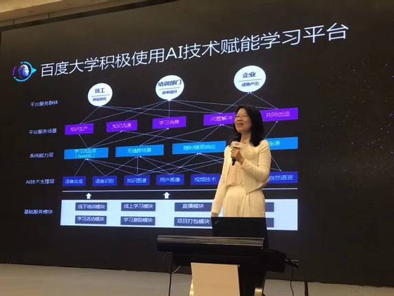
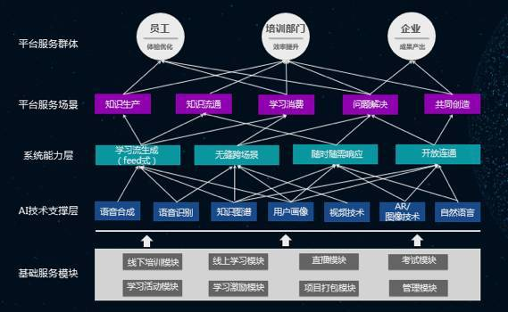
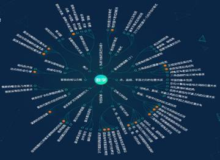

# 这个idea靠谱！百度公开AI×Learning的全部基础框架
_2017-11-01 09:21:24 搜狐 我要报错_

人们一直在说，人工智能将改革一切。AI究竟能为世界带来什么？虽然现在全球数千家公司已经在应用人工智能，但绝大多数重要机会尚未发掘。现在，瓶颈出现在管理、执行和商业想象力方面。

AI最突出的两大应用领域是感知和认知。前一类别中出现的一些重大实践进展主要体现在语音识别和图像识别，第二类重大突破是认知和问题解决能力的提升，机器学习系统不仅正在取代多个应用软件中的传统算法，还在很多人类曾经最擅长的任务中有更优秀的表现。

AI时代的企业学习又会变成什么样呢？AI技术能否帮助我们克服常见的企业学习痛点，激活在线学习活力呢？近日，百度大学执行副校长、百度学习发展执行总监伍晖女士，在上海ATD 2017中国峰会上，发布了最新的百度大学AI×Learning基础架构，引起了培训圈同仁的浓厚兴趣。

  
  

  △伍晖女士发布百度大学AI×Learning基础架构
  

  
  

  △百度大学AI×Learning基础架构
  

正如伍晖女士现场公布的基础架构图所示，百度大学通过AI技术支撑层，赋能企业学习系统。通过系统能力层的完善，进一步优化平台服务场景，最终通过创新式地解决企业在线学习中的痛点、难点，让员工、培训部门和企业从中受益。

## 把所有知识“织”成一张聪明的网

### 知识图谱技术

知识图谱，是显示知识发展进程与结构关系的一系列各种不同的图形，用可视化技术描述知识资源及其载体，挖掘、分析、构建、绘制和显示知识及它们之间的相互联系。通过知识图谱技术，能够将企业知识库中所有信息进行整合和联系，形成底层图谱。

  
  

  △知识图谱底层
  

